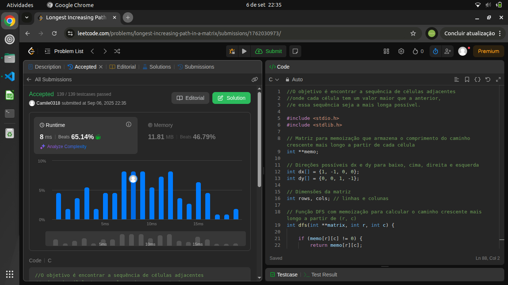
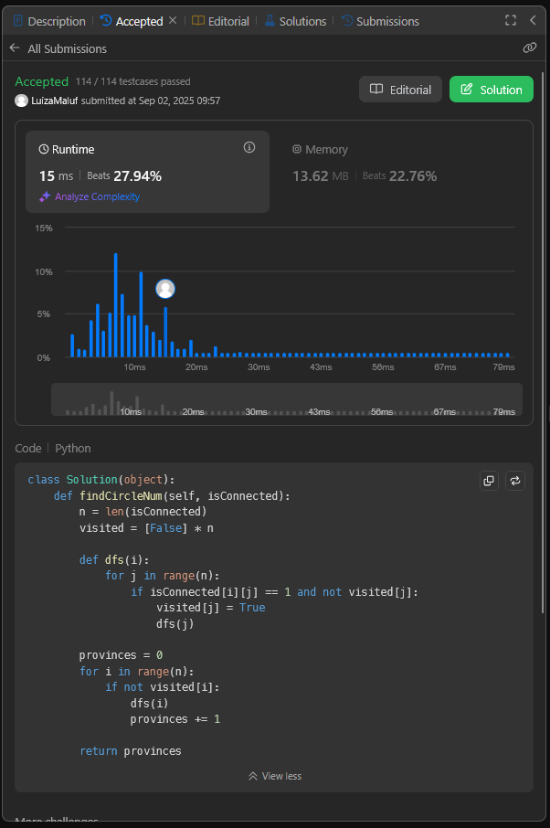
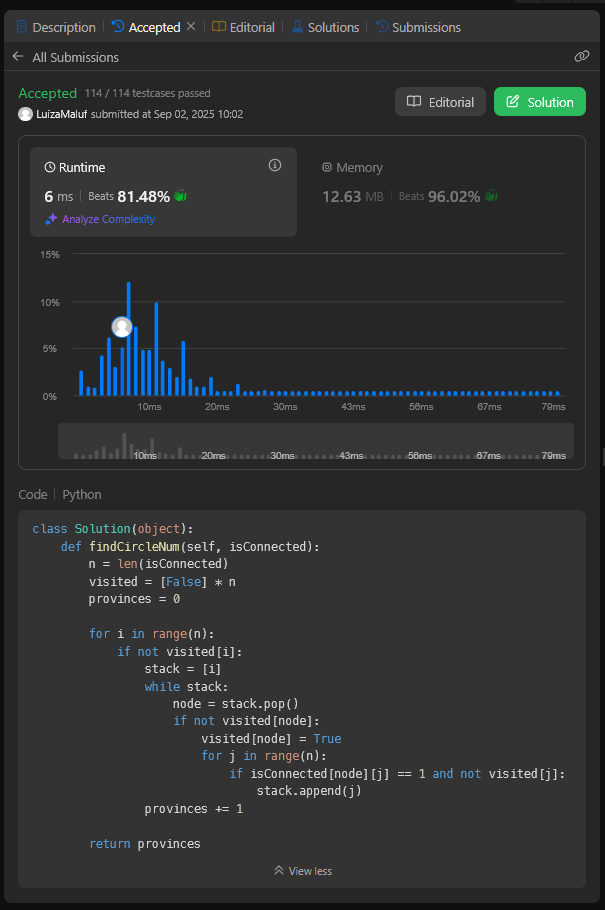
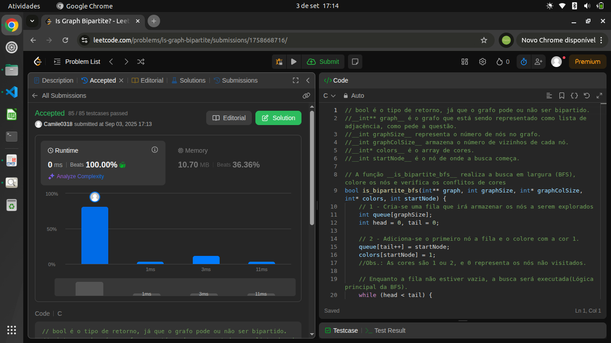
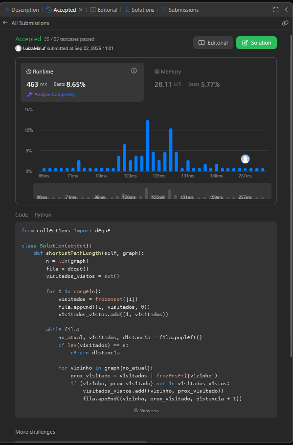

# Grafos1_LeetCode_D8

Repositório da Dupla 08 do semeste 2025.2.

**Conteúdo:** Gráfos 1.

## Alunos

| Matrícula | Aluno |
|-----------|-------|
| 25/1035022 | Camile Barbosa Gonzaga De Oliveira |
| 22/1008294 | Luiza Maluf Amorim |

## Objetivo

Desenvolver questões em que possamos explorar nossos conhecimentos desenvolvidos em sala de aula sobre o assunto Grafos 1.

## Instalação

- **Linguagem**: Python e C.

## Exercícios

|Código do Problema| Nome do Problema | Resolução | Dificuldade |
|------------------|------------------|-----------|-------------|
| 329. | [Longest increasing path in a Matrix](https://leetcode.com/problems/longest-increasing-path-in-a-matrix)| [Resolução 329](329_longest_increasing_path.c) | Difícil |
| 547. | [Number of Provinces](https://leetcode.com/problems/number-of-provinces/?envType=problem-list-v2&envId=graph) | [Resolução 547](547_NumberOfProvinces.py)| Médio |
| 785. | [Is Graph Bipartite](https://leetcode.com/problems/is-graph-bipartite)| [Resolução 785](785_IsGraphBipartite.c) | Médio |
| 847. | [Shortest Path Visiting All Nodes](https://leetcode.com/problems/shortest-path-visiting-all-nodes)| [Resolução 847](847_ShortestPathVisitingAllNodes.py) | Difícil |

## Apresentação

[Link para a apresentação](https://www.youtube.com/watch?v=elH0050AoHQ)

## Screenshots

### 329.

<center>



</center>

### 547.
<center>

**Primeira versão** 




**Versão interativa e otimizada**



</center>

### 785.

<center>



</center>

### 847.

<center>



</center>


## Pré-requisitos

### Python
- Ter o [Python 3](https://www.python.org/downloads/) instalado na máquina.  
- (Opcional) Criar e ativar um ambiente virtual:
  ```bash
  python3 -m venv venv
  source venv/bin/activate   # Linux/Mac
  venv\Scripts\activate      # Windows
  ```

### C
- Ter um compilador C instalado . O GCC (GNU Compiler Collection) é o mais utilizado e ele já vem pré-instalado em muitos sistemas operacionais (como Linux e macOS).
- Se você estiver no Windows e precisar instalar o GCC, pode considerar o uso do MinGW ou do Cygwin.

- (Opcional) Acessar um compilador C online para escrever, compilar e executar o código diretamente no navegador.

## Como rodar

### Python 

Para executar uma solução específica:

 ```bash
 python nome_do_arquivo.py
 ```

### C

 ```bash
gcc nome_do_arquivo.c
./a.out 
 ```
